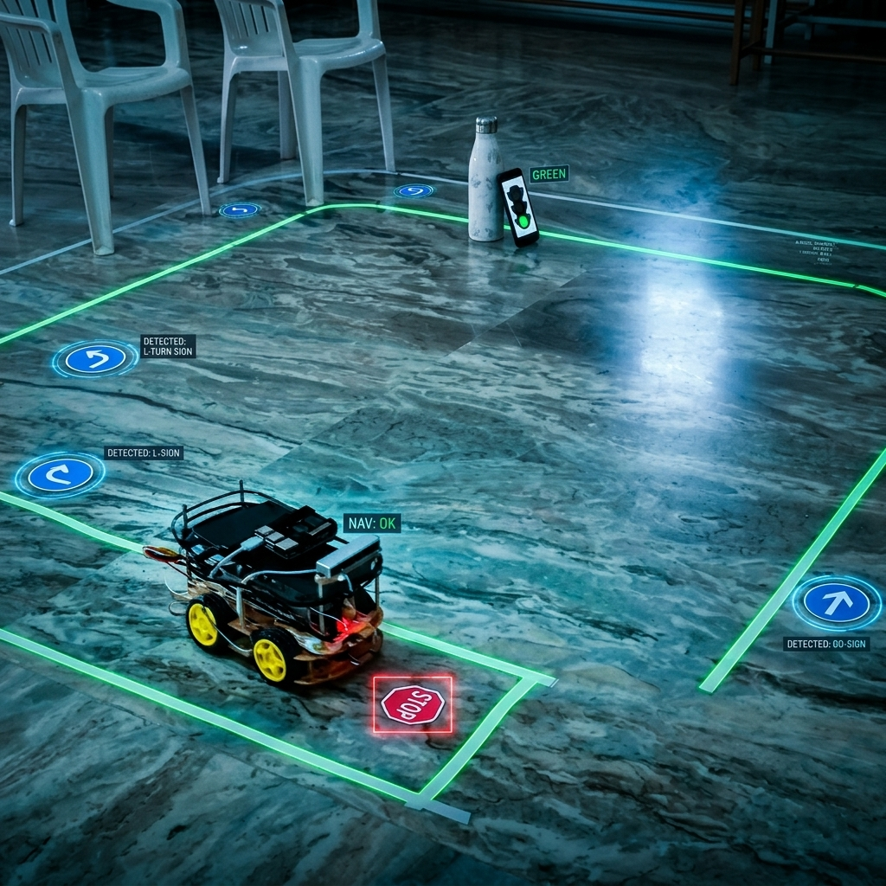
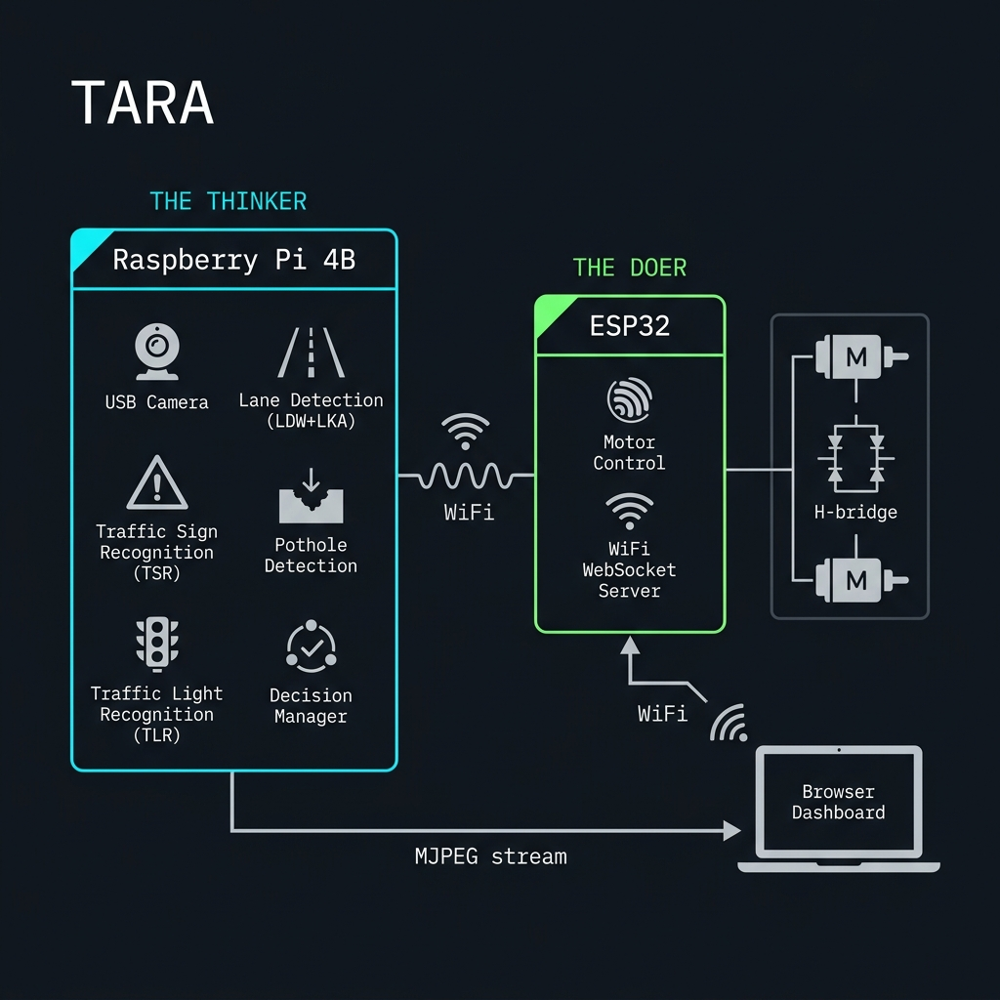

#  TARA-Tracking_Adaptive_Road_Autonomous_Car


> Real hardware ADAS prototype on Raspberry Pi 4B + ESP32.
> All perception runs at the edge — no cloud, no GPU, no internet required.

## 📺 Project Demo Video
[}(https://aseblr-my.sharepoint.com/:v:/g/personal/bl_en_u4ece23205_bl_students_amrita_edu/IQBQWoQdkXzRSrZKP6C_6L9nAat1XS3q58vhPzQDuP0mqzo?e=8RBRgA)

*Click the image above to watch the TARA hardware demo on SharePoint.*

---

## 🎮 Simulation Companion

Before deploying to real hardware, validate the full ADAS decision stack inside the CARLA photorealistic simulator:

**[rushikesh-D69/TARA-Tracking_Adaptive_Road_Autonomous_Car](https://github.com/rushikesh-D69/TARA-Tracking_Adaptive_Road_Autonomous_Car)**

The simulation repo runs the same lane detection, TSR, ACC, and TLR pipeline inside CARLA, allowing parameter tuning before physical deployment. **This repository is the real hardware deployment.**

---

## 🤖 What TARA Does

TARA is a differential-drive robot car that autonomously navigates an indoor test track using a stack of ADAS features:

| Feature | Method | Latency |
|---------|--------|---------|
| Lane Departure Warning (LDW) | Adaptive threshold + polynomial offset | < 10 ms |
| Lane Keeping Assist (LKA) | Proportional steering from BEV polynomial | < 10 ms |
| Traffic Sign Recognition (TSR) | MobileNetV2 INT8 TFLite, 43-class GTSRB | ~20 ms |
| Pothole Detection | MobileNetV2 binary classifier INT8 | ~20 ms |
| Adaptive Cruise Control (ACC) | Vision-only speed policy | < 1 ms |
| Traffic Light Recognition (TLR) | HSV colour masks + circularity filter | < 5 ms |
| Directional Sign Detection | OpenCV blue-circle + arrow centroid | < 3 ms |

All modules feed a priority arbitrator (`DecisionManager`) that outputs a single normalised command `(steer_x, speed_y)` sent to the ESP32 over WiFi WebSocket.

---

## ⚙️ Hardware

| Component | Detail |
|-----------|--------|
| Compute | Raspberry Pi 4B — 4 GB RAM, 64-bit quad-core ARM |
| Microcontroller | ESP32 — motor control, WebSocket server, sensor I/O |
| Camera | USB webcam, 640 x 480 @ 30 fps |
| Motor driver | TB6612FNG dual H-bridge |
| Drivetrain | 4-wheel differential drive |
| IMU | MPU-6050 (I2C) |
| Encoders | Optical quadrature, left + right wheels |
| Power | RPi: dedicated 5 V 3 A; Motors: separate LiPo |
| Track | White insulation tape on marble floor |

---

## 📂 Repository Layout

```
TARA/
├── README.md               <- You are here
├── walkthrough.md          <- End-to-end setup and run guide
│
├── rpi/                    <- Raspberry Pi ADAS software (Python)
│   ├── main.py             <- Full ML pipeline entry point
│   ├── brute_force_lane.py <- No-ML pixel-counting lane follower
│   ├── config.py           <- Central tuning parameters
│   ├── requirements.txt    <- Python dependencies
│   │
│   ├── adas/               <- Perception + decision modules
│   │   ├── lane_detection.py
│   │   ├── traffic_sign.py
│   │   ├── pothole_detection.py
│   │   ├── adaptive_cruise.py
│   │   ├── traffic_light.py
│   │   ├── sign_detector_cv.py
│   │   └── decision_manager.py
│   │
│   ├── camera/             <- Threaded camera capture
│   ├── comms/              <- ESP32 WiFi WebSocket bridge
│   ├── utils/              <- FPS counter and logger
│   ├── models/             <- TFLite model files (not tracked in git)
│   └── training/           <- Model training scripts (run on PC)
│
├── esp32/
│   └── Dashboard/          <- Browser dashboard + ESP32 firmware
│
└── docs/
    ├── setup_guide.md      <- Hardware wiring and OS setup
    └── PICS/               <- Hardware photos and diagrams
```

---

## 🚀 Quick Start

```bash
# 1. Clone and enter the repo
git clone https://github.com/rushikesh-D69/TARA-Hardware.git
cd TARA

# 2. Install Python dependencies on the Raspberry Pi
pip install -r rpi/requirements.txt

# 3. Set your ESP32 IP in config.py
#    ESP32_HOST = "192.168.X.X"

# 4. Run (vision-only — no ESP32 needed for first test)
cd rpi
python3 main.py --no-wifi --debug
# Open http://<RPI_IP>:5000/ in a browser to see the live annotated feed

# 5. Full autonomous run
python3 main.py --debug
```

See [`walkthrough.md`](walkthrough.md) for the complete phase-by-phase guide.

---

## 🏗️ System Architecture



```
Raspberry Pi 4B                             ESP32
┌──────────────────────┐  WiFi WebSocket   ┌──────────────────────┐
│  Camera (USB)        │  ──────────────→  │  WebSocket Server    │
│  Lane Detection      │  auto_cmd JSON    │  Motor PWM Control   │
│  TSR (TFLite)        │                   │  TB6612FNG H-bridge  │
│  Pothole (TFLite)    │  ←──────────────  │  Encoder read        │
│  TLR (HSV)           │  SEN: telemetry   │  MPU-6050 IMU        │
│  Decision Manager    │                   └──────────────────────┘
│  MJPEG stream :5000  │
└──────────────────────┘
         |
         | HTTP :80
         v
  Browser Dashboard
  (manual control + telemetry)
```

---

## 📝 License

MIT — see [LICENSE](LICENSE).
