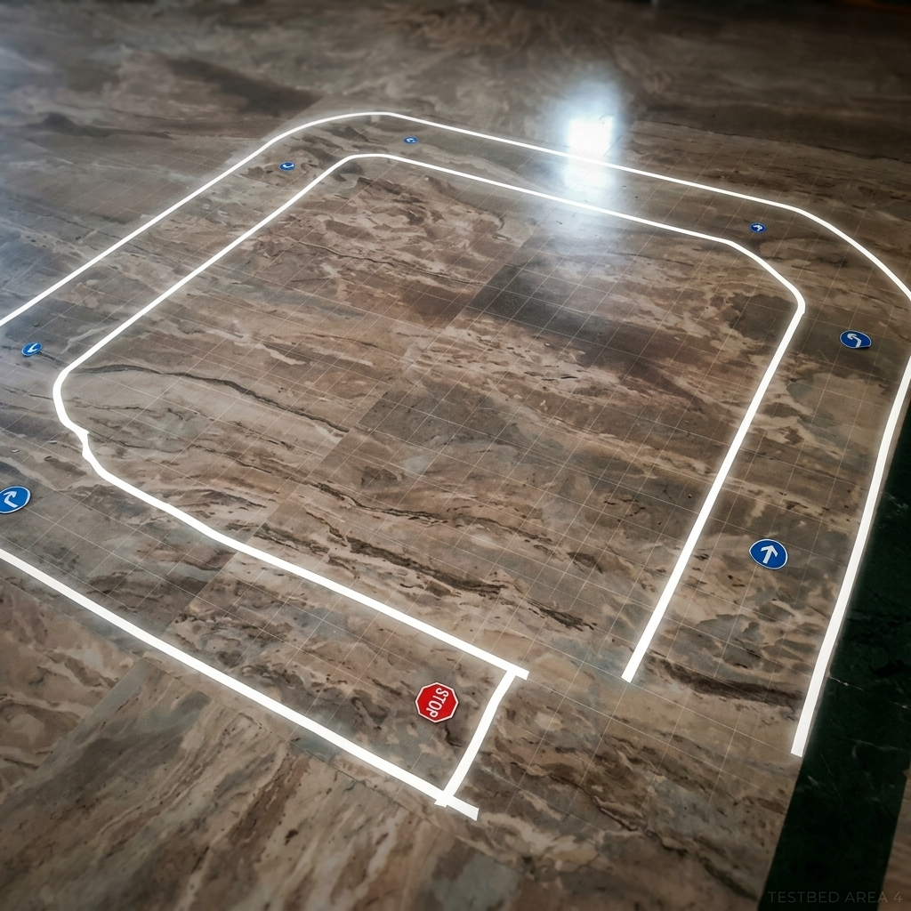
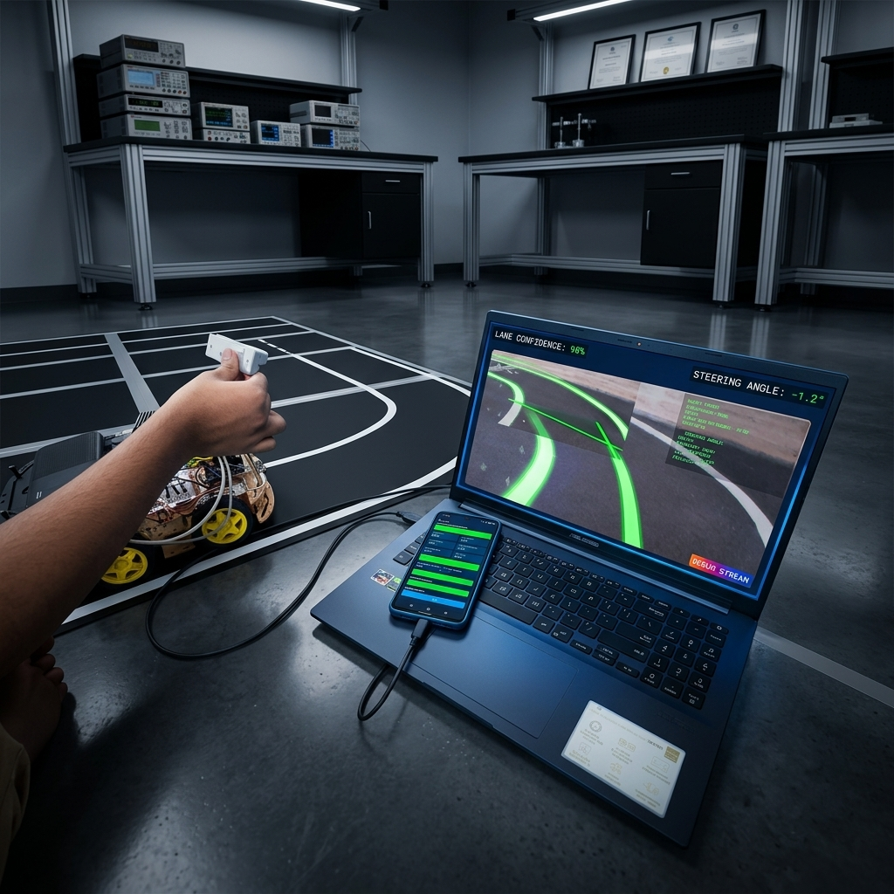
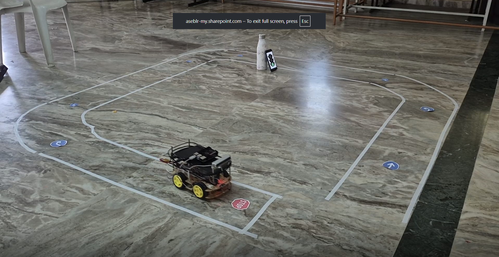
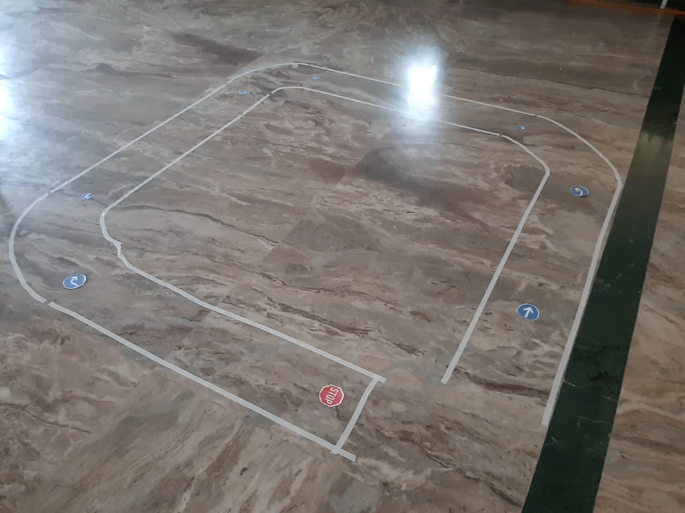
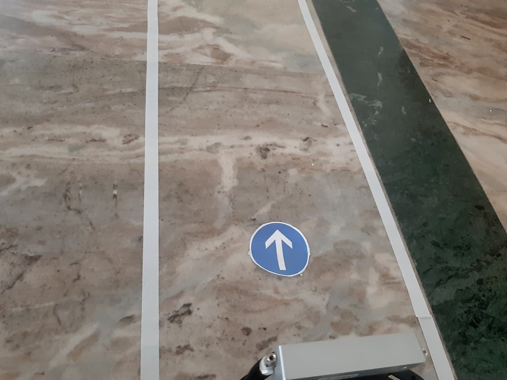
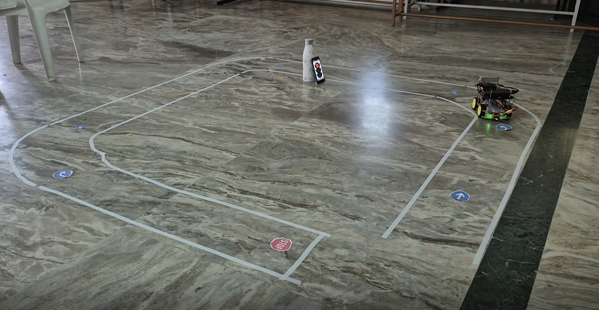
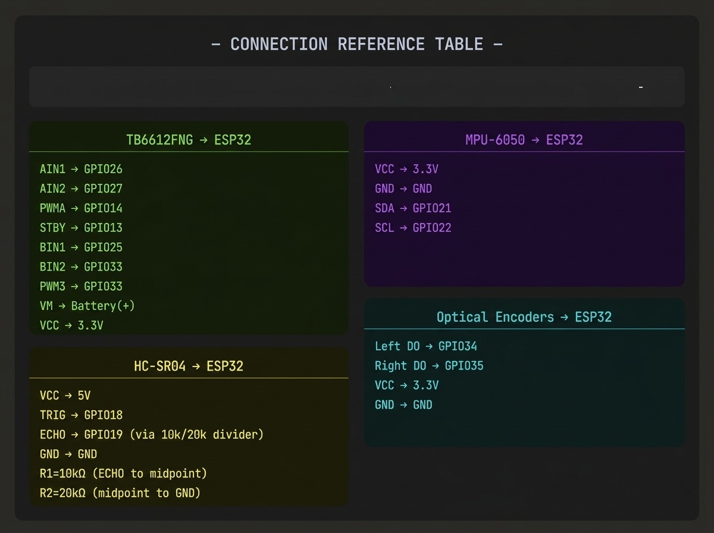

# TARA — System Walkthrough

> Throttle-Adaptive Road Autonomous — real hardware ADAS prototype on Raspberry Pi 4B + ESP32.
> Read top to bottom. Each phase depends on the one before it.

---


*TARA navigating the indoor marble-floor test track — white tape lanes, blue directional signs, red STOP sign, and a simulated traffic light.*

---

## Simulation First?

> [!NOTE]
> Before running on real hardware, validate the ADAS logic entirely in software using the CARLA simulator.
> The companion simulation repository is available at:
> **[rushikesh-D69/TARA-Tracking_Adaptive_Road_Autonomous_Car](https://github.com/rushikesh-D69/TARA-Tracking_Adaptive_Road_Autonomous_Car)**
>
> The simulation runs the same decision stack (lane detection, TSR, ACC, TLR) inside CARLA's photorealistic environment, letting you tune parameters before deploying to real hardware. **This repository is the real hardware deployment.**

---

## Part 1: What Are We Building?

TARA is a real hardware robot with two compute nodes:


```
Raspberry Pi 4B                           ESP32
┌────────────────────────┐  WiFi WebSocket  ┌──────────────────────┐
│  USB Camera            │ ──────────────→  │  WebSocket Server    │
│  Lane Detection        │  auto_cmd JSON   │  Motor PWM Control   │
│  TSR (TFLite)          │                  │  TB6612FNG H-bridge  │
│  Pothole (TFLite)      │ ←──────────────  │  Encoder read        │
│  TLR (HSV)             │  SEN: telemetry  │  MPU-6050 IMU        │
│  Decision Manager      │                  └──────────────────────┘
│  MJPEG stream :5000    │
└────────────────────────┘
         |
         | HTTP :80
         v
  Browser Dashboard
  (manual control + telemetry)
```

> [!IMPORTANT]
> The RPi and ESP32 communicate over WiFi WebSocket (not a USB serial cable).
> All nodes — RPi, ESP32, Dashboard — must be on the same WiFi network.

---

## Part 2: The Test Track



The indoor test arena uses white insulation tape on a marble floor to form a closed-loop circuit with:

| Element | Purpose |
|---------|---------|
| White tape lanes | Lane keeping (LDW + LKA) |
| Blue circular signs (arrows) | Directional landmark navigation |
| Red STOP sign | Traffic Sign Recognition (TSR) hard stop |
| Phone displaying traffic light | Traffic Light Recognition (TLR) |
| Water bottle obstacle | Obstacle placement for avoidance demo |

> [!NOTE]
> The marble floor is a challenging surface — its glossy finish creates reflections and variable lighting.
> The adaptive threshold (`LANE_ADAPTIVE_BLOCK_SIZE = 51`) in `config.py` was tuned specifically for this environment.

---

## Part 3: What Does Each File Do?

### Raspberry Pi — `rpi/`

| File | Role |
|------|------|
| `main.py` | Pipeline entry point — owns all modules, runs the 4-frame scheduler |
| `brute_force_lane.py` | No-ML fallback lane follower (pixel counting, reliable for demos) |
| `config.py` | Single source of truth for all tunable parameters |
| `adas/lane_detection.py` | LDW + LKA — adaptive threshold, bird's-eye warp, sliding-window polynomial fit |
| `adas/traffic_sign.py` | TSR — MobileNetV2 INT8 TFLite, GTSRB 43-class, majority voting |
| `adas/pothole_detection.py` | Pothole — MobileNetV2 binary classifier or SSD |
| `adas/adaptive_cruise.py` | ACC — vision-only cruise speed policy |
| `adas/traffic_light.py` | TLR — HSV colour masks + circularity validation |
| `adas/sign_detector_cv.py` | Directional sign — OpenCV blue-circle + white-arrow centroid |
| `adas/decision_manager.py` | Priority arbitrator — outputs normalised Command(steer_x, speed_y) |
| `comms/ws_bridge.py` | WebSocket client to ESP32 |
| `camera/capture.py` | Threaded camera (live + video file) |
| `utils/fps_counter.py` | Rolling FPS + per-module timing |
| `utils/logger.py` | Structured logger |

### ESP32 — `esp32/Dashboard/`

The ESP32 runs AsyncWebServer (port 80) that:
- Hosts the browser Dashboard at `/`
- Serves a WebSocket endpoint at `/ws` accepting JSON commands from RPi and dashboard

---

## Part 4: Which Features Need ML Training?

> [!IMPORTANT]
> Only 2 of the 7 ADAS features require trained TFLite models. The rest are pure OpenCV.

| Feature | Needs Training? | Method |
|---------|----------------|--------|
| Lane Detection (LDW + LKA) | No | Adaptive threshold + polynomial fit |
| Traffic Light Recognition | No | HSV colour masks + shape validation |
| Directional Sign Detection | No | OpenCV blue-circle + centroid |
| Adaptive Cruise Control | No | Vision-only speed policy |
| Decision Manager | No | Priority if/else arbitration |
| Traffic Sign Recognition | Yes | MobileNetV2 INT8 (GTSRB 43-class) |
| Pothole Detection | Yes | MobileNetV2 binary classifier |

---

## Part 5: The 5 Phases

```
Phase 1          Phase 2          Phase 3          Phase 4          Phase 5
TRAIN            CONVERT          FLASH ESP32      SETUP RPi        RUN
(PC / Colab)     (PC)             (Arduino IDE)    (RPi terminal)   (RPi terminal)
    |                |                |                |                |
    v                v                v                v                v
Train models ->  Make TFLite ->  Upload firmware ->  Install deps ->  python3 main.py
```

---

### Phase 1: Train the Models (PC or Google Colab)

> [!NOTE]
> You only do this once. Models can be reused across runs.

#### Step 1.1 — Get the Datasets

**Traffic Signs (GTSRB):**
```
https://benchmark.ini.rub.de/gtsrb_dataset.html
Download "GTSRB Final Training Images"
Unzip class folders (00000-00042) to:
   training/datasets/GTSRB/
```

**Potholes:**
```
https://www.kaggle.com/datasets/sachinpatel21/pothole-image-dataset
Organise into:
   training/datasets/pothole/pothole/   <- pothole images
   training/datasets/pothole/normal/    <- clear road images
```

#### Step 1.2 — Train

```bash
cd training/
pip install tensorflow numpy opencv-python

python train_tsr.py --epochs 50 --fine-tune
# Output: saved_models/tsr_mobilenetv2_final/

python train_pothole.py --epochs 40 --fine-tune
# Output: saved_models/pothole_mobilenetv2_final/
```

---

### Phase 2: Convert to TFLite (still on PC)

```bash
python convert_to_tflite.py \
    --model saved_models/tsr_mobilenetv2_final \
    --output tsr_mobilenetv2_int8.tflite \
    --input-size 96 \
    --validate

python convert_to_tflite.py \
    --model saved_models/pothole_mobilenetv2_final \
    --output pothole_mobilenetv2_int8.tflite \
    --input-size 128 \
    --validate
```

You will have:
```
tsr_mobilenetv2_int8.tflite       (~1.5 MB)
pothole_mobilenetv2_int8.tflite   (~2 MB)
```

Copy to `rpi/models/` on the RPi (via SCP or USB drive).

---

### Phase 3: Flash the ESP32

> [!NOTE]
> Use Arduino IDE 2.x with the ESP32 board package installed.

1. Install [Arduino IDE](https://www.arduino.cc/en/software)
2. File -> Preferences -> Additional Board Manager URLs -> add:
   ```
   https://raw.githubusercontent.com/espressif/arduino-esp32/gh-pages/package_esp32_index.json
   ```
3. Tools -> Board -> Board Manager -> search "ESP32" -> Install
4. Open `esp32/Dashboard/` sketch
5. Tools -> Board -> ESP32 Dev Module
6. Tools -> Port -> select your ESP32's COM port
7. Click Upload and wait for "Done uploading"

---

### Phase 4: Set Up the Raspberry Pi

#### Step 4.1 — Install OS

1. Download [Raspberry Pi OS 64-bit Lite](https://www.raspberrypi.com/software/)
2. Flash to microSD using Raspberry Pi Imager (enable SSH)
3. Boot and SSH in

#### Step 4.2 — Install Dependencies

```bash
sudo apt update && sudo apt upgrade -y
sudo apt install -y python3-venv python3-pip libatlas-base-dev

python3 -m venv ~/tara-venv
source ~/tara-venv/bin/activate

cd ~/TARA/rpi
pip install -r requirements.txt
```

#### Step 4.3 — Copy Model Files

```bash
# From your PC:
scp tsr_mobilenetv2_int8.tflite     pi@<RPI_IP>:~/TARA/rpi/models/
scp pothole_mobilenetv2_int8.tflite pi@<RPI_IP>:~/TARA/rpi/models/
```

#### Step 4.4 — Configure Network

Edit `rpi/config.py`:
```python
ESP32_HOST = "192.168.X.X"   # set to your ESP32's current IP
CAMERA_INDEX = 0             # check with: ls /dev/video*
```

#### Step 4.5 — Hardware Connection

```
Raspberry Pi 4B
  USB Port 1  <- USB Webcam (camera)
  USB-C       <- 5V 3A dedicated power supply (NOT motor battery)

ESP32 (on same WiFi network)
  TB6612FNG -> 4 motors
  MPU-6050  -> I2C (SDA=GPIO21, SCL=GPIO22)
  Optical encoders (Left=GPIO34, Right=GPIO35)
```

> [!IMPORTANT]
> Power the RPi from a separate 5V 3A supply, never from the motor battery.
> Motor voltage spikes corrupt SD card writes and crash the pipeline.

---

### Phase 5: Run

```bash
source ~/tara-venv/bin/activate
cd ~/TARA/rpi

# Vision-only (no ESP32 needed) — good for first test
python3 main.py --no-wifi --debug

# Full autonomous run
python3 main.py --debug

# Headless production run
python3 main.py

# No-ML pixel-counting fallback (very reliable for track completion)
python3 brute_force_lane.py --debug

# Test with recorded video
python3 main.py --video challenge_video.mp4 --debug
```

The `--debug` flag starts an MJPEG stream at `http://<RPI_IP>:5000/` viewable in any browser.

---

## Part 6: Live Debug Stream



When running with `--debug`, the MJPEG stream shows:
- Green lines — detected left and right lane polynomials
- Status panel — FPS, steering command, lane offset, TSR class, traffic light state
- LDW: DEPARTURE! in red — lane departure warning active
- LDW: RECOVERY in orange — both lanes temporarily lost, using polynomial history

---

## Part 7: Obstacle Detection and Avoidance


*Live obstacle avoidance: pothole detected on one side, DecisionManager overrides LKA steering for 0.8 s hold + 0.4 s blend-back to lane center.*

The avoidance sequence in `DecisionManager`:

```
1. PotholeDetector returns pothole_detected=True with position ("left"/"right"/"center")
2. Two consecutive positive detections confirm (double-frame gating)
3. Avoidance steer applied: opposite direction to pothole
4. Hold for 0.8 s at reduced speed (60% of normal)
5. Linear blend back to LKA steering over 0.4 s
6. Normal lane-keep resumes
```

---

## Part 8: Frame Schedule

```
Every 4-frame cycle at 25 fps = one cycle every ~160 ms:

  Frame 0:   Lane + ACC
  Frame 1:   Lane + TSR
  Frame 2:   Lane + ACC + TLR
  Frame 3:   Lane + Pothole
  Frames 0,2: SignCV (every 2nd frame)
  All frames: DecisionManager
```

---

## Part 9: Decision Priority

| Priority | Module | Effect |
|----------|--------|--------|
| 1 (highest) | Traffic Light RED | Immediate full stop, bypasses smoothing |
| 2 | Traffic Light YELLOW | 30% speed, bypasses smoothing |
| 3 | Pothole Avoidance | Override steering 0.8 s + 0.4 s blend-back |
| 4 | TSR Speed Cap | Sets speed_y ceiling, auto-expires after 10 s |
| 5 | ACC Throttle | Cruise speed setpoint (0.0-1.0) |
| 6 | Lane Keeping Assist | Proportional steering from polynomial offset |
| 7 (lowest) | LDW Warning | Flag only — no actuation |

---

## Part 10: Hardware Gallery

````carousel

*TARA mid-circuit — blue directional signs visible, traffic light phone ahead, STOP sign on ground.*
<!-- slide -->

*Top-down view of the complete test arena. White tape forms the dual-lane circuit with directional markers at each corner.*
<!-- slide -->

*Camera-level view of a blue straight-ahead directional sign inside the lane, as seen by the robot.*
<!-- slide -->

*TARA executing a turn at a directional sign landmark.*
<!-- slide -->

*ESP32 GPIO reference: TB6612FNG motor driver, HC-SR04 ultrasonic, MPU-6050 IMU, optical encoders.*
````

---

## Part 11: Troubleshooting

| Problem | Solution |
|---------|---------|
| `Camera not found` | `ls /dev/video*` — try `CAMERA_INDEX = 1` in `config.py` |
| `TSR model not loaded` | Copy `.tflite` files to `rpi/models/`. Check path in `config.py` |
| `ESP32 WiFi not connected` | Verify `ESP32_HOST` in `config.py`. Use `--no-wifi` for vision-only test |
| `Low FPS (< 5)` | Add heatsink + fan to RPi, or reduce `PROC_WIDTH = 240` in `config.py` |
| `Car drives erratically` | Increase `LANE_STEERING_DEADBAND`. Check camera mounting angle |
| `Lane not detected` | Tune `LANE_ADAPTIVE_C` (try -10 to -20). Check ambient lighting |
| `TSR flickering` | Normal — majority voting stabilises over 5 frames. Lower `TSR_CONFIDENCE_THRESHOLD` if under-detecting |
| `Pothole false positives` | Raise `POTHOLE_CONFIDENCE_THRESHOLD` to 0.75 |
| `Traffic light ignored` | Ensure the phone is in the top 30% of the camera frame |

---

## Quick Reference

```
┌──────────────────────────────────────────────────────────────┐
│                    TARA QUICK REFERENCE                      │
├──────────────────────────────────────────────────────────────┤
│                                                              │
│  TRAIN MODELS (PC):                                          │
│    cd training/                                              │
│    python train_tsr.py --epochs 50 --fine-tune               │
│    python train_pothole.py --epochs 40 --fine-tune           │
│    python convert_to_tflite.py --model ... --output ...      │
│                                                              │
│  FLASH ESP32:                                                │
│    Open esp32/Dashboard/ in Arduino IDE -> Upload            │
│                                                              │
│  CONFIGURE:                                                  │
│    Edit rpi/config.py -> set ESP32_HOST and CAMERA_INDEX     │
│                                                              │
│  RUN ON RPi:                                                 │
│    source ~/tara-venv/bin/activate && cd ~/TARA/rpi          │
│    python3 main.py --debug            # with MJPEG stream    │
│    python3 main.py                    # headless             │
│    python3 main.py --no-wifi --debug  # camera only          │
│    python3 brute_force_lane.py --debug  # no-ML fallback     │
│                                                              │
│  DEBUG STREAM:  http://<RPI_IP>:5000/                        │
│  DASHBOARD:     http://<ESP32_IP>/                           │
│                                                              │
│  STOP:  Ctrl+C                                               │
│                                                              │
│  SIMULATION:                                                 │
│    github.com/rushikesh-D69/                                 │
│    TARA-Tracking_Adaptive_Road_Autonomous_Car                │
│                                                              │
└──────────────────────────────────────────────────────────────┘
```
